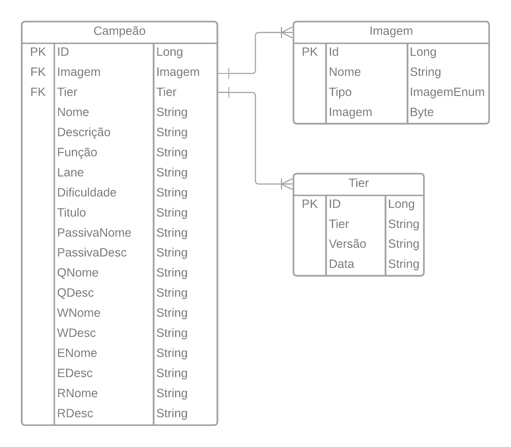

# ChampionsAPI

API para salvar, editar, buscar campeoes

## Database Diagram

  

## API Mapping 

| Mapping | Path | Função |
| ------------- | ------------- | ------------- |
| GET | /champions | Retorna uma lista com todos os campeoes cadastrados |
| GET | /champions/{id} | Retorna um campeao especificado pelo Id |
| GET | /champions/{id}/images | Retorna uma lista de imagens do campeao especificado pelo Id |
| GET | /champions/{id}/images/{tipo} | Retorna uma lista de imagens de um tipo especifico de um campeao |
| GET | /images | Retorna uma lista das imagens cadastradas |
| GET | /images/{id} | Retorna uma uma imagem especificada pelo id |
| POST | /champions | Salva um novo campeao |
| POST | /images | Salva uma nova imagem |
| POST | /images/{tipo} | Salva uma nova imagem com um tipo especificado|
| PUT | /champions/{id} | Edita o campeao especificado pelo id |
| PUT | /champions/{id}/images/{id} | Adiciona a imagem para o campeao |
| PUT | /images/{id} | Edita uma imagem especificada pelo id |
| DELETE | /champions/{id} | Deleta o campeao especificado pelo id |
| DELETE | /images/{id} | Deleta uma imagem especificada pelo id |

## Outros detalhes

- O campo tipo da imagem pode ser **SPLASH**, **MINIATURA** ou **LOADING**;
- O campeao e a imagem podem ser criados a parte e depois interligados pelo PUT, sendo especificado o Id do campeao e da imagem;
